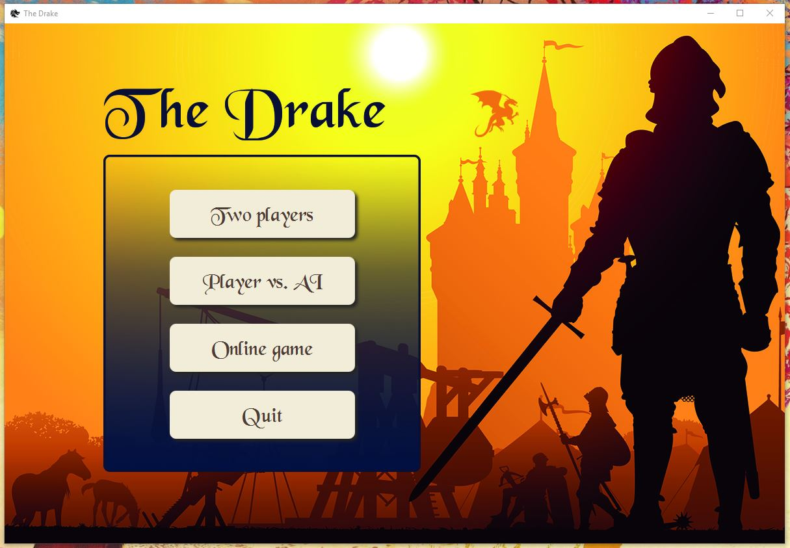
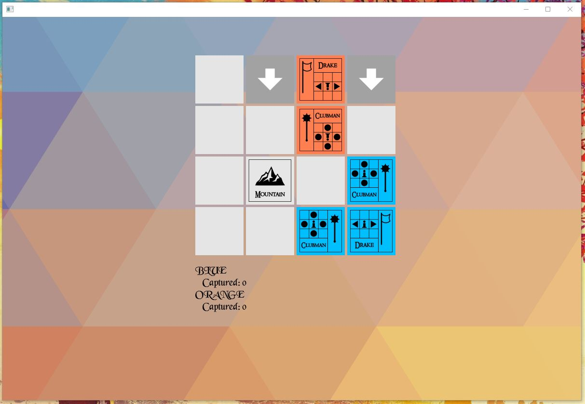

# BI-PJV-2018

Turn-based game [The Drake](http://podlomar.org/thedrake.html) programed in Java 8. Part of code was already received at the beginning and during work on this project (which was made in 8 iterations).

---
To run: open as project in jetbrains idea and run it there or in bash by JDK 8(source code filepath: "2_assignment\src\bi\zum\lab3")

Game menu
---

Game
---

